# EchoGuard

Wearable night-time obstacle alert to help seniors navigate safely in the dark.  
Built for **EGN 2020C – Engineering Design & Society** (Fall 2024).

---

## Overview
EchoGuard is a smart hat-mounted device designed for elderly individuals with impaired vision.  
It uses an **ultrasonic distance sensor, LED, and piezo buzzer** to warn users of nearby obstacles, helping prevent injuries in low-light environments.

Our goal was to create a device that is:
- **Simple to use** – just wear the hat, no setup needed.  
- **Safe** – real-time alerts reduce the chance of collisions.  
- **Affordable & recyclable** – 3D-printed casing with replaceable parts.  

---

## Features
- Ultrasonic sensor detects obstacles within **50 cm**  
- LED light and buzzer provide immediate feedback  
- Hat-mounted design for easy wearability  
- Lightweight 3D-printed casing, recyclable materials  
- Expandable design (PCB, laser sensor upgrades possible)  

---

## Prototype

Photos of the final functional prototype:

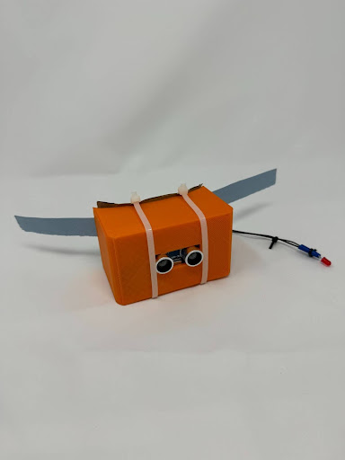  
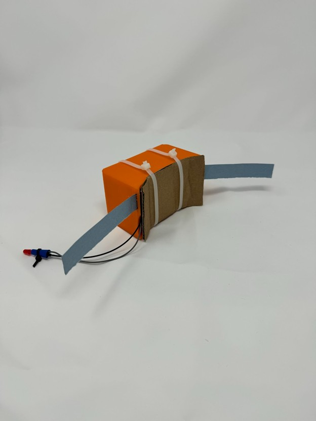  
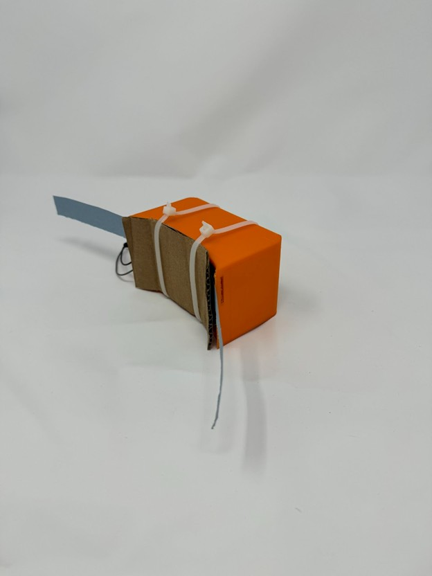  
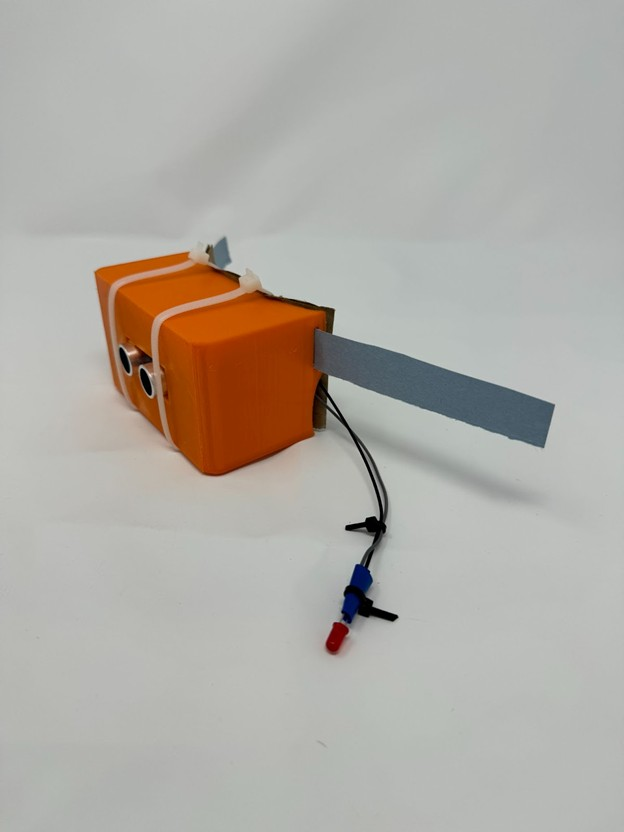  

---

## Circuit Diagram

Circuit built in Tinkercad/Wokwi with Arduino UNO, ultrasonic sensor, LED, and piezo:

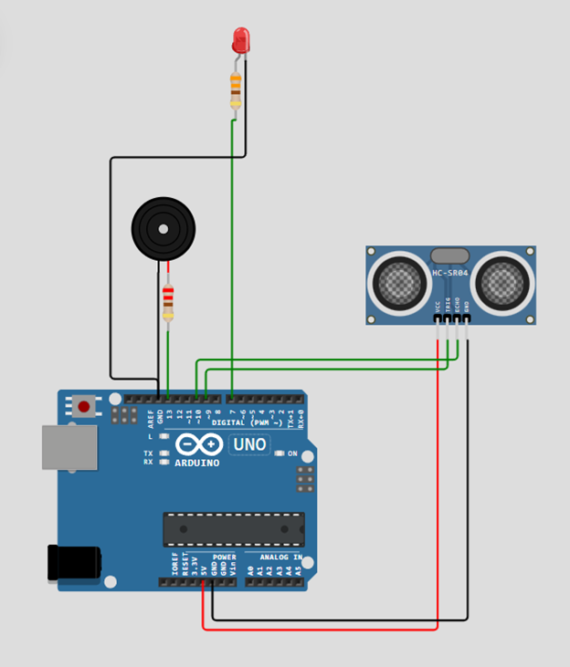  

---

## CAD & Engineering Drawings

**CAD Renders (Onshape)**  
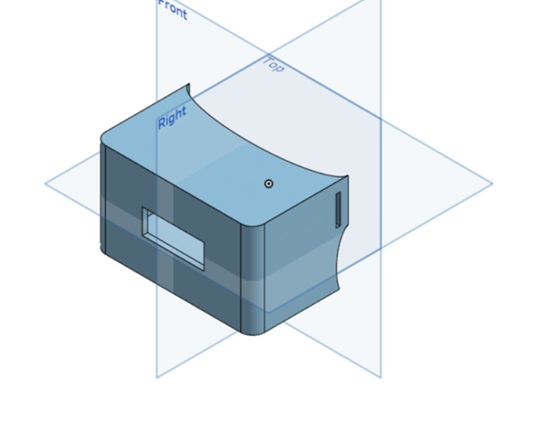  
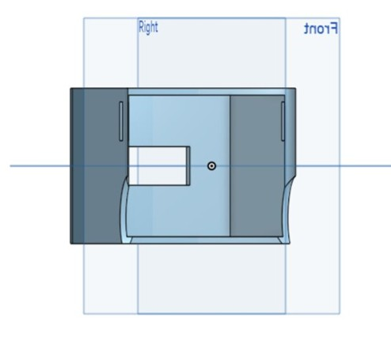  
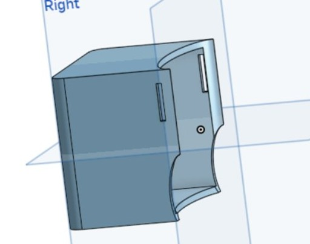  

Onshape CAD link: [EchoGuard CAD](https://cad.onshape.com/documents/f8a072819d4efed5e4eada95/w/a9f80a0febac5b87d37619c0/e/f2e79e53a91569b659359e4b)

**Notebook Drawings**  
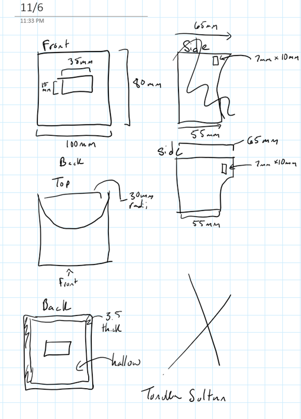  
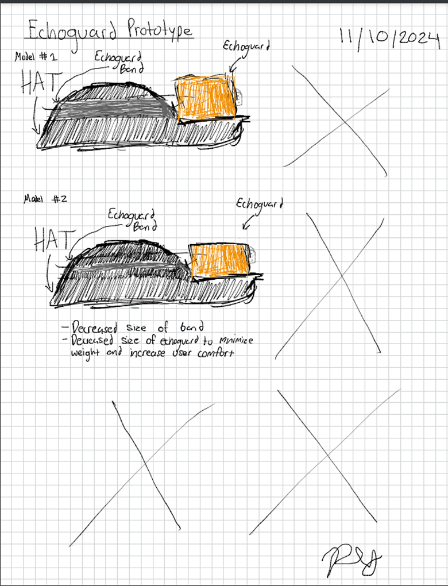  

---

## System Logic Flow

Our device continuously checks distance every 0.5s.  
If an object is detected within 50 cm → LED lights up + buzzer sounds.  
If no object is detected → both turn off.  

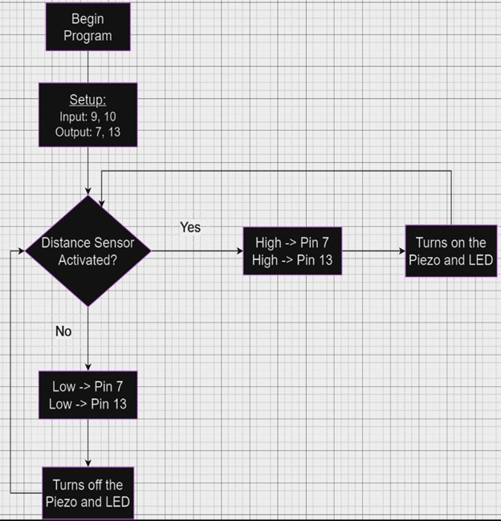  

---

## Hardware Components
- Arduino UNO  
- HC-SR04 Ultrasonic Distance Sensor  
- Passive Piezo Buzzer  
- RGB LED  
- 220Ω & 330Ω Resistors  
- 3D-printed mount (PLA)  
- Standard breadboard wiring  

---

## Code
The Arduino code is provided in [echoguard.ino](echoguard.ino).  

Key logic:
- Ultrasonic sensor triggers on **trigPin (9)**, reads echo on **echoPin (10)**  
- Distance calculated in cm  
- If `< 50 cm`, activate **LED (pin 7)** + **Buzzer (pin 13)**  
- Otherwise, both stay off  

---

## Simulation & Demo
- Wokwi Simulation: [EchoGuard Circuit](https://wokwi.com/projects/416310596585245697)  

---

## Limitations & Future Improvements
- **Ultrasonic accuracy**: occasional false positives when angled → could be improved with laser distance sensor.  
- **Size/weight**: current prototype uses Arduino UNO → could be miniaturized with a **PCB**.  
- **Battery life**: longer-term optimization possible.  

Despite these limitations, the prototype reliably alerts users of obstacles within range.

---

## Team
- Steven Trejos  
- Peter Yungman  
- Tonuka Sultan  
- Szymon Sierzega  

---

## License
This project is for educational purposes as part of EGN 2020C.  
You may reuse or adapt with attribution.
